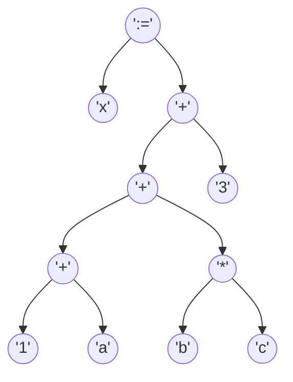
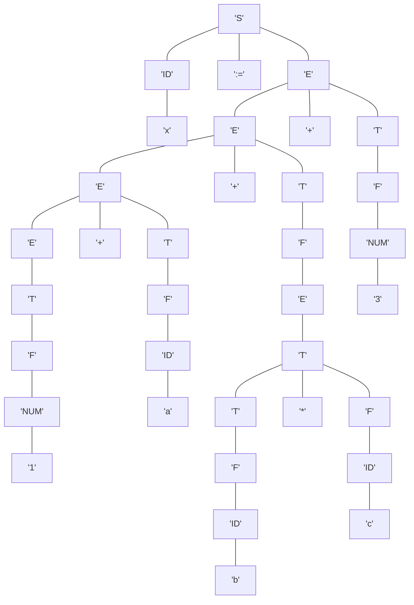

# Reporte de Compilación para la Expresión

`x := 1 + a + (b * c) + 3`

---

# Fase 1: Análisis
## 1.1. Análisis Lexicográfico

El código fuente se descompone en los siguientes tokens:

| Tipo                    | Valor         |
|-------------------------|---------------|
| ID                      | `x`      |
| OPERADOR_ASIGNACION     | `:=`      |
| NUMERO_ENTERO           | `1`      |
| OPERADOR_ARITMETICO     | `+`      |
| ID                      | `a`      |
| OPERADOR_ARITMETICO     | `+`      |
| PAREN                   | `(`      |
| ID                      | `b`      |
| OPERADOR_ARITMETICO     | `*`      |
| ID                      | `c`      |
| PAREN                   | `)`      |
| OPERADOR_ARITMETICO     | `+`      |
| NUMERO_ENTERO           | `3`      |

---
## 1.2. Análisis Sintáctico (AST)

La expresión se ha validado y convertido en un Árbol de Sintaxis Abstracta (AST), que representa su estructura operativa.

**Notación Postfija intermedia:** `x 1 a + b c * + 3 + :=`

---
## 1.3. Análisis Semántico

La secuencia de tokens es válida según la gramática. Se genera el siguiente árbol de derivación:

---

# Fase 2: Síntesis
## 3. Representación Intermedia

### Notación Postfija (Polaca Inversa)
`x 1 a + b c * + 3 + :=`

### Tripletas
La expresión se traduce en la siguiente secuencia de instrucciones de tres direcciones:

| # | Operador | Operando 1 | Operando 2 |
|---|----------|------------|------------|
|(0)| `+`     | `1`     | `a`     |
|(1)| `*`     | `b`     | `c`     |
|(2)| `+`     | `(0)`     | `(1)`     |
|(3)| `+`     | `(2)`     | `3`     |
|(4)| `:=`     | `x`     | `(3)`     |
