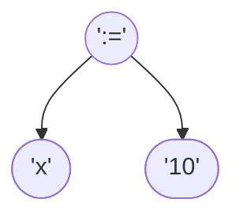
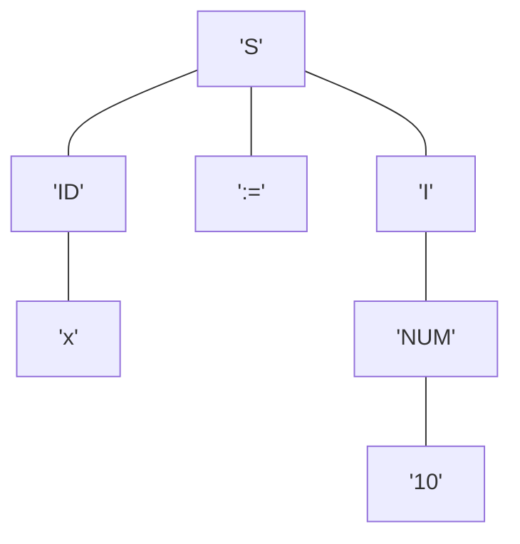
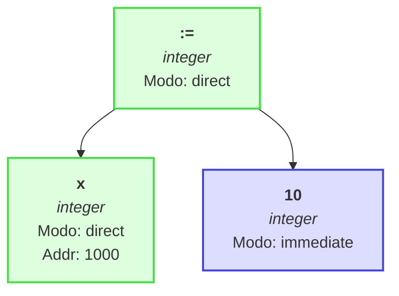
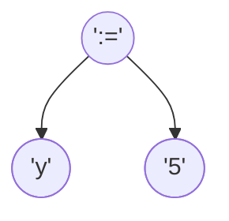
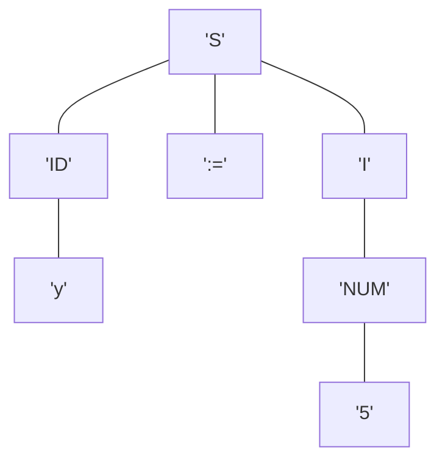
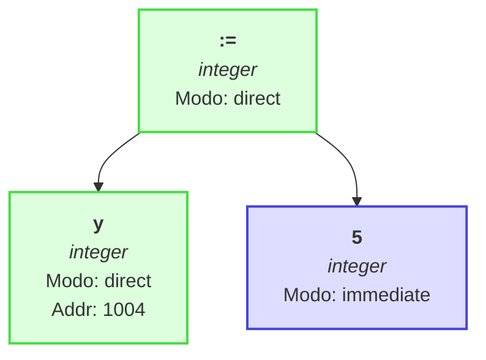
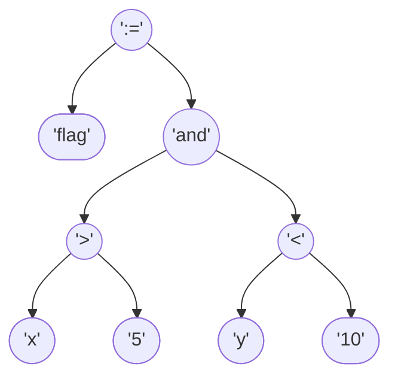
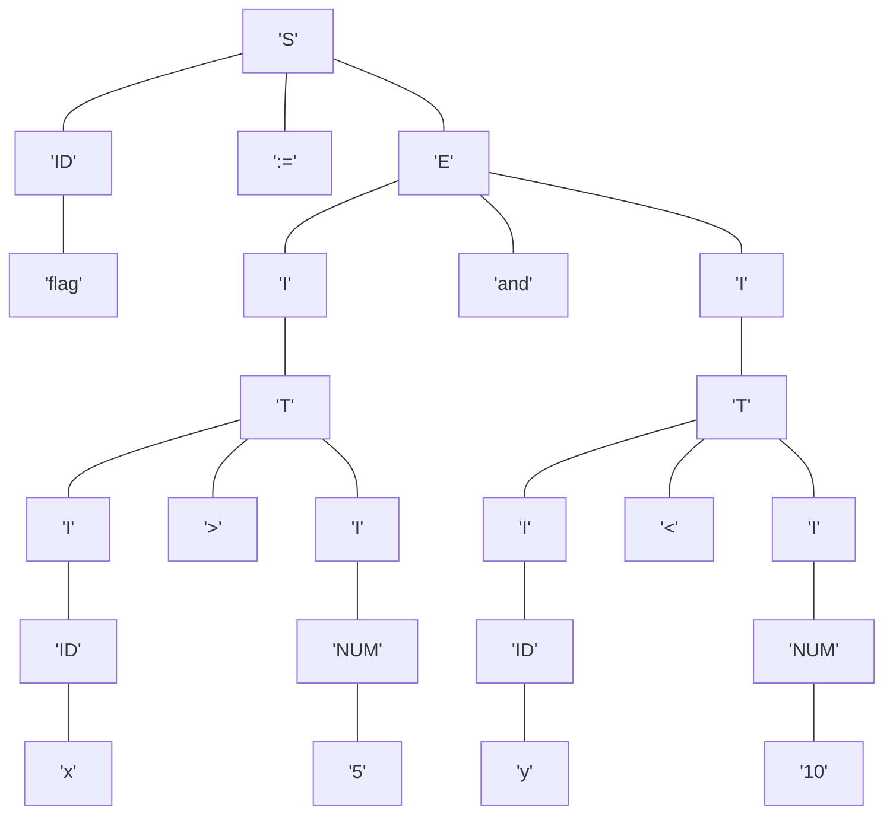
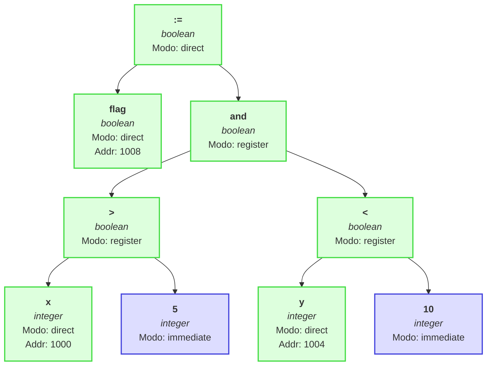

# Reporte de Compilación

```pascal

        program Prueba;
        var
          x, y : integer;
          flag : boolean;
        
        begin
          x := 10;
          y := 5;
          flag := (x > 5) and (y < 10);
        end.
        
```

---

# Fase 0: Análisis de Declaraciones

## Tabla de Símbolos Variables (Declaradas)

## Tabla de Símbolos Variables

| ID | Nombre | Tipo | Scope | Dirección |
|----|--------|------|-------|-----------|
| 10797 | x | integer | 0 | 1000 |
| 10365 | y | integer | 0 | 1004 |
| 10221 | flag | boolean | 0 | 1008 |

**Total de símbolos:** 3
**Siguiente dirección disponible:** 100C

---

# Fase 1: Análisis
## 1.1. Análisis Lexicográfico

El código fuente se descompone en los siguientes tokens:

| Token | Lexema | ID Tabla |
|-------|--------|----------|
| RESERVED_WORD | `program` | 8 |
| PROGRAM_NAME | `prueba` | PROGRAM |
| DELIMITER | `;` | 202 |
| RESERVED_WORD | `var` | 1 |
| IDENTIFIER | `x` | 10797 |
| COMMA | `,` | None |
| IDENTIFIER | `y` | 10365 |
| COLON | `:` | None |
| RESERVED_WORD | `integer` | 5 |
| DELIMITER | `;` | 202 |
| IDENTIFIER | `flag` | 10221 |
| COLON | `:` | None |
| RESERVED_WORD | `boolean` | 9 |
| DELIMITER | `;` | 202 |
| RESERVED_WORD | `begin` | 3 |
| IDENTIFIER | `x` | 10797 |
| OPERATOR | `:=` | 101 |
| CONSTANT | `10` | None |
| DELIMITER | `;` | 202 |
| IDENTIFIER | `y` | 10365 |
| OPERATOR | `:=` | 101 |
| CONSTANT | `5` | None |
| DELIMITER | `;` | 202 |
| IDENTIFIER | `flag` | 10221 |
| OPERATOR | `:=` | 101 |
| PAREN | `(` | None |
| IDENTIFIER | `x` | 10797 |
| OPERATOR | `>` | 108 |
| CONSTANT | `5` | None |
| PAREN | `)` | None |
| OPERATOR | `and` | 112 |
| PAREN | `(` | None |
| IDENTIFIER | `y` | 10365 |
| OPERATOR | `<` | 107 |
| CONSTANT | `10` | None |
| PAREN | `)` | None |
| DELIMITER | `;` | 202 |
| RESERVED_WORD | `end` | 4 |
| DELIMITER | `.` | 206 |

---
## Tablas Fijas del Lenguaje

### Palabras Reservadas
| ID | Palabra |
|----|---------|
| 1 | var |
| 2 | proc |
| 3 | begin |
| 4 | end |
| 5 | integer |
| 6 | char |
| 7 | real |
| 8 | program |
| 9 | boolean |
| 10 | string |

### Operadores
| ID | Operador |
|----|----------|
| 101 | := |
| 102 | + |
| 103 | - |
| 104 | * |
| 105 | / |
| 106 | = |
| 107 | < |
| 108 | > |
| 109 | <= |
| 110 | >= |
| 111 | <> |
| 112 | and |
| 113 | or |
| 114 | not |

### Delimitadores
| ID | Delimitador |
|----|-------------|
| 201 | : |
| 202 | ; |
| 203 | ( |
| 204 | ) |
| 205 | , |
| 206 | . |

---

## Fase 1.2: Análisis Sintáctico

### Sentencia 1
### 1.2.1. Generación de Árbol de Expresión

La expresión se ha validado y convertido en un Árbol de Sintaxis Abstracta (AST), que representa su estructura operativa.

**Notación Postfija intermedia:** `x 10 :=`



---
### 1.2.2. Comprobación Sintáctica / Comprobación de Tipos

La secuencia de tokens es válida según la gramática. Se genera el siguiente árbol de derivación:



---
## 1.3. Análisis Semántico

Se verifica la compatibilidad de tipos recorriendo el AST. Cada nodo se anota con su tipo inferido o con un error.



### Resumen de Tipos en la Expresión

- **integer**: 3 ocurrencias

---

# Fase 2: Síntesis
## 3. Representación Intermedia

### Notación Postfija (Polaca Inversa)
`x 10 :=`

### Tripletas
La expresión se traduce en la siguiente secuencia de instrucciones de tres direcciones:

| # | Operador | Operando 1 | Operando 2 |
|---|----------|------------|------------|
|(0)| `:=`     | `x`     | `10`     |

### Sentencia 2
### 1.2.1. Generación de Árbol de Expresión

La expresión se ha validado y convertido en un Árbol de Sintaxis Abstracta (AST), que representa su estructura operativa.

**Notación Postfija intermedia:** `y 5 :=`



---
### 1.2.2. Comprobación Sintáctica / Comprobación de Tipos

La secuencia de tokens es válida según la gramática. Se genera el siguiente árbol de derivación:



---
## 1.3. Análisis Semántico

Se verifica la compatibilidad de tipos recorriendo el AST. Cada nodo se anota con su tipo inferido o con un error.



### Resumen de Tipos en la Expresión

- **integer**: 3 ocurrencias

---

# Fase 2: Síntesis
## 3. Representación Intermedia

### Notación Postfija (Polaca Inversa)
`y 5 :=`

### Tripletas
La expresión se traduce en la siguiente secuencia de instrucciones de tres direcciones:

| # | Operador | Operando 1 | Operando 2 |
|---|----------|------------|------------|
|(0)| `:=`     | `y`     | `5`     |

### Sentencia 3
### 1.2.1. Generación de Árbol de Expresión

La expresión se ha validado y convertido en un Árbol de Sintaxis Abstracta (AST), que representa su estructura operativa.

**Notación Postfija intermedia:** `flag x 5 > y 10 < and :=`



---
### 1.2.2. Comprobación Sintáctica / Comprobación de Tipos

La secuencia de tokens es válida según la gramática. Se genera el siguiente árbol de derivación:



---
## 1.3. Análisis Semántico

Se verifica la compatibilidad de tipos recorriendo el AST. Cada nodo se anota con su tipo inferido o con un error.



### Resumen de Tipos en la Expresión

- **boolean**: 5 ocurrencias
- **integer**: 4 ocurrencias

---

# Fase 2: Síntesis
## 3. Representación Intermedia

### Notación Postfija (Polaca Inversa)
`flag x 5 > y 10 < and :=`

### Tripletas
La expresión se traduce en la siguiente secuencia de instrucciones de tres direcciones:

| # | Operador | Operando 1 | Operando 2 |
|---|----------|------------|------------|
|(0)| `>`     | `x`     | `5`     |
|(1)| `<`     | `y`     | `10`     |
|(2)| `and`     | `(0)`     | `(1)`     |
|(3)| `:=`     | `flag`     | `(2)`     |
