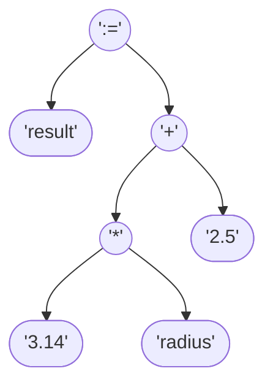
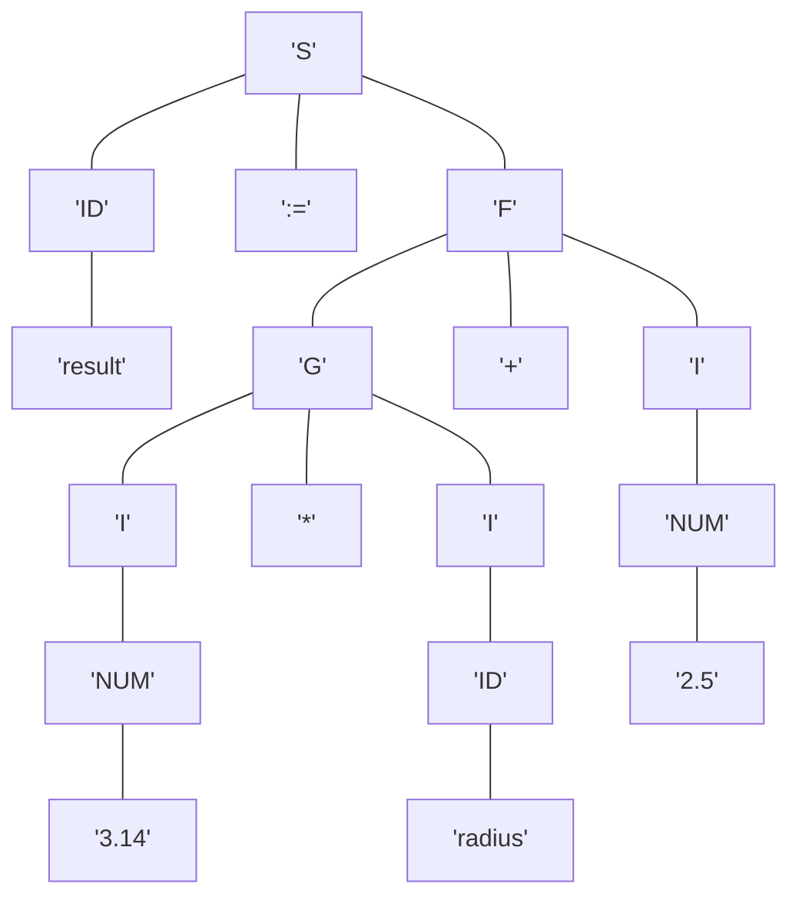
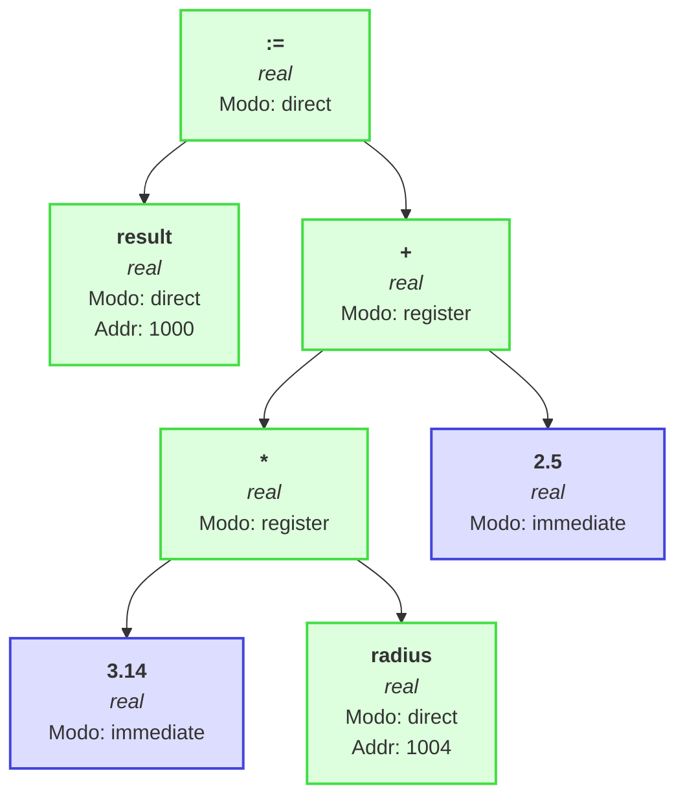

# Reporte de Compilación para la Expresión

`result := 3.14 * radius + 2.5`

---

# Fase 1: Análisis
## 1.1. Análisis Lexicográfico

El código fuente se descompone en los siguientes tokens:

| Tipo | Valor | ID |
|------|-------|----|
| IDENTIFIER | `result` | 10721 |
| OPERATOR | `:=` | 101 |
| CONSTANT | `3.14` | None |
| OPERATOR | `*` | 104 |
| IDENTIFIER | `radius` | 10610 |
| OPERATOR | `+` | 102 |
| CONSTANT | `2.5` | None |

---
## Tablas Fijas del Lenguaje

### Palabras Reservadas
| ID | Palabra |
|----|---------|
| 1 | var |
| 2 | proc |
| 3 | begin |
| 4 | end |
| 5 | integer |
| 6 | char |
| 7 | real |

### Operadores
| ID | Operador |
|----|----------|
| 101 | := |
| 102 | + |
| 103 | - |
| 104 | * |
| 105 | / |
| 106 | = |
| 107 | < |
| 108 | > |
| 109 | <= |
| 110 | >= |
| 111 | <> |
| 112 | and |
| 113 | or |
| 114 | not |

### Delimitadores
| ID | Delimitador |
|----|-------------|
| 201 | : |
| 202 | ; |
| 203 | ( |
| 204 | ) |

## Tabla de Símbolos Variables

| ID | Nombre | Tipo | Scope | Dirección | Modo |
|----|--------|------|-------|-----------|------|
| 10721 | result | real | 0 | 1000 | direct |
| 10610 | radius | real | 0 | 1004 | direct |

**Total de símbolos:** 2
**Siguiente dirección disponible:** 1008

---

## Fase 1.2: Análisis Sintáctico
### 1.2.1. Generación de Árbol de Expresión

La expresión se ha validado y convertido en un Árbol de Sintaxis Abstracta (AST), que representa su estructura operativa.

**Notación Postfija intermedia:** `result 3.14 radius * 2.5 + :=`

---
### 1.2.2. Comprobación Sintáctica / Comprobación de Tipos

La secuencia de tokens es válida según la gramática. Se genera el siguiente árbol de derivación:

---
## 1.3. Análisis Semántico

Se verifica la compatibilidad de tipos recorriendo el AST. Cada nodo se anota con su tipo inferido o con un error.

### Resumen de Tipos en la Expresión

- **real**: 7 ocurrencias

---

# Fase 2: Síntesis
## 3. Representación Intermedia

### Notación Postfija (Polaca Inversa)
`result 3.14 radius * 2.5 + :=`

### Tripletas
La expresión se traduce en la siguiente secuencia de instrucciones de tres direcciones:

| # | Operador | Operando 1 | Operando 2 |
|---|----------|------------|------------|
|(0)| `*`     | `3.14`     | `radius`     |
|(1)| `+`     | `(0)`     | `2.5`     |
|(2)| `:=`     | `result`     | `(1)`     |
