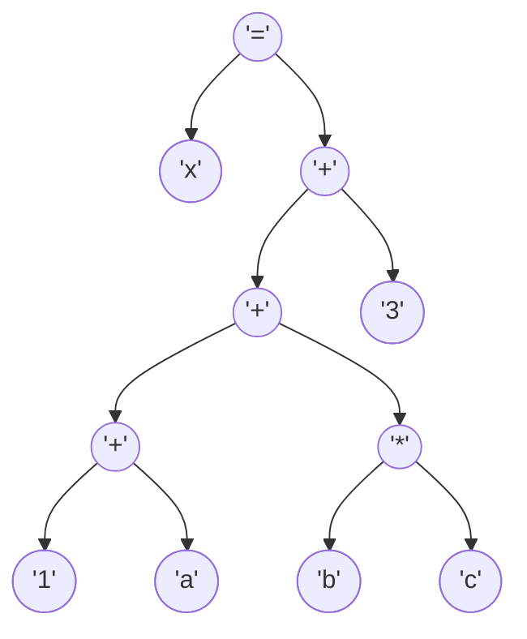
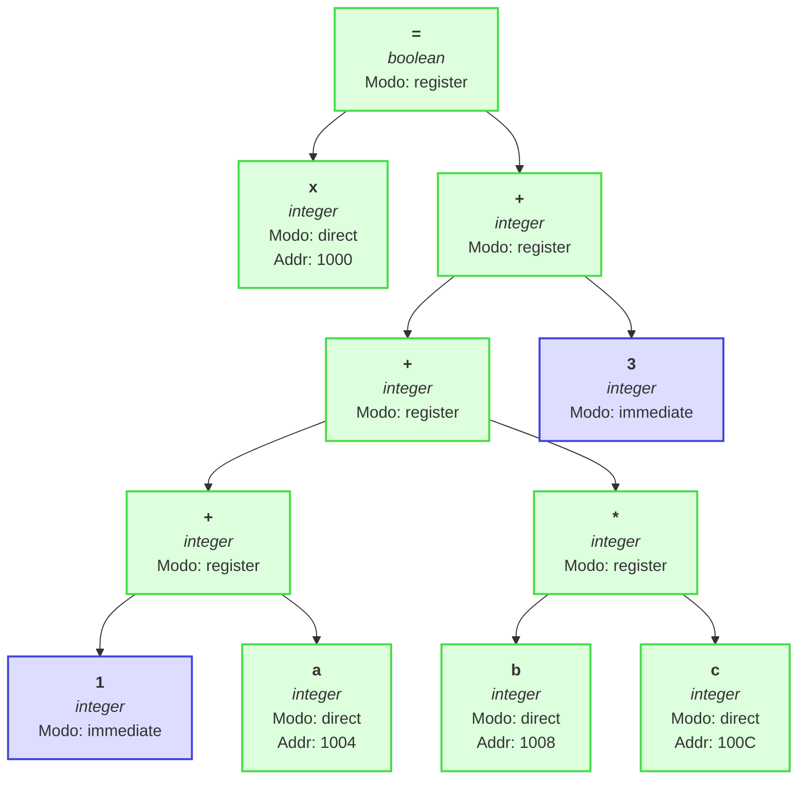

# Proceso de Compilación

**Expresión:** `x := 1 + a + (b * c) + 3`

---

## 1. Parseo (Lectura del código fuente)

También llamado **análisis de entrada**, es el paso más bajo del compilador.
El compilador **no recibe palabras**, sino una **secuencia de caracteres**.

> **Objetivo:**
> Identificar los **límites de las palabras** (tokens potenciales) usando **delimitadores** como espacios, comas, puntos y comas, o paréntesis.

**Ejemplo:**

```
x := 1 + a + (b * c) + 3
```

El parser lee carácter por carácter:

| Paso | Carácter |
|:----:|:--------:|
| 1 | `x` |
| 2 | ` ` (espacio) |
| 3 | `:` |
| 4 | `=` |
| 5 | ` ` (espacio) |
| 6 | `1` |
| 7 | ` ` (espacio) |
| 8 | `+` |
| 9 | ` ` (espacio) |
| 10 | `a` |
| 11 | ` ` (espacio) |
| 12 | `+` |
| 13 | ` ` (espacio) |
| 14 | `(` |
| 15 | `b` |
| 16 | ` ` (espacio) |
| 17 | `*` |
| 18 | ` ` (espacio) |
| 19 | `c` |
| 20 | `)` |
| 21 | ` ` (espacio) |
| 22 | `+` |
| 23 | ` ` (espacio) |
| 24 | `3` |
| 25 | fin de línea |

**Lexemas identificados:**
x : = 1 + a + ( b * c ) + 3

 En esta etapa **no se evalúa nada**, solo se **segmenta** el flujo de caracteres en **palabras válidas (lexemas)**.

---


## 2. Análisis Lexicográfico

El **análisis léxico** toma las palabras detectadas y las clasifica según su tipo.
Para ello, el compilador compara cada lexema con **tablas de referencia**.

>**Objetivo:**
> Convertir la secuencia de caracteres en una **secuencia de tokens** (unidades mínimas con significado).

---

### Tablas consultadas

#### a) Tabla fija (Palabras reservadas y operadores)

| Código | Token | Tipo |
|:------:|:-----:|:----:|
| 1 | `var` | palabra reservada |
| 2 | `proc` | palabra reservada |
| 3 | `begin` | palabra reservada |
| 4 | `end` | palabra reservada |
| 5 | `integer` | palabra reservada |
| 6 | `char` | palabra reservada |
| 7 | `real` | palabra reservada |
| 101 | `:=` | operador |
| 102 | `+` | operador |
| 103 | `-` | operador |
| 104 | `*` | operador |
| 105 | `/` | operador |
| 106 | `=` | operador |
| 107 | `<` | operador |
| 108 | `>` | operador |
| 109 | `<=` | operador |
| 110 | `>=` | operador |
| 111 | `<>` | operador |
| 112 | `and` | operador |
| 113 | `or` | operador |
| 114 | `not` | operador |
| 201 | `:` | delimitador |
| 202 | `;` | delimitador |
| 203 | `(` | delimitador |
| 204 | `)` | delimitador |

#### b) Tabla variable (Identificadores y constantes)

| Posición | Lexema | Tipo | Valor |
|:--------:|:------:|:----:|:-----:|
| 10339 | `x` | integer | None |
| 10862 | `a` | integer | None |
| 10042 | `b` | integer | None |
| 10157 | `c` | integer | None |
| 10890 | `1` | integer | 1 |
| 10746 | `3` | integer | 3 |

---

### Tokens generados

| Tipo | Valor |
|:-----|:-----:|
| IDENTIFIER | `x` |
| DELIMITER | `:` |
| OPERATOR | `=` |
| CONSTANT | `1` |
| OPERATOR | `+` |
| IDENTIFIER | `a` |
| OPERATOR | `+` |
| DELIMITER | `(` |
| IDENTIFIER | `b` |
| OPERATOR | `*` |
| IDENTIFIER | `c` |
| DELIMITER | `)` |
| OPERATOR | `+` |
| CONSTANT | `3` |

---

### Resultado del análisis léxico:

Una lista de **tokens** identificados y clasificados, sin errores.
Si existiera una palabra desconocida, el compilador la reportaría como **símbolo no reconocido**.

---


## 3. Análisis Sintáctico

### 1.2.1. Generación de Árbol de Expresión

La expresión se ha validado y convertido en un Árbol de Sintaxis Abstracta (AST), que representa su estructura operativa.

**Notación Postfija intermedia:** `x 1 a + b c * + 3 + =`



### 1.2.2. Comprobación Sintáctica / Comprobación de Tipos

**Error de sintaxis:** Error de sintaxis: Se esperaba operador ':=' pero se encontró DELIMITER (':')

La secuencia de tokens no pudo ser validada completamente por la gramática.


## 4. Análisis Semántico

## 1.3. Análisis Semántico

Se verifica la compatibilidad de tipos recorriendo el AST. Cada nodo se anota con su tipo inferido o con un error.



### Tablas de operadores

**Tabla de \+**

|          | integer | real | char | boolean | string |
|:---------|:---:|:---:|:---:|:---:|:---:|
| **integer** | integer | real | — | — | — |
| **real** | real | real | — | — | — |
| **char** | — | — | — | — | — |
| **boolean** | — | — | — | — | — |
| **string** | — | — | — | — | string |

**Tabla de \***

|          | integer | real | char | boolean | string |
|:---------|:---:|:---:|:---:|:---:|:---:|
| **integer** | integer | real | — | — | — |
| **real** | real | real | — | — | — |
| **char** | — | — | — | — | — |
| **boolean** | — | — | — | — | — |
| **string** | — | — | — | — | — |


### Resumen de Tipos en la Expresión

- **boolean**: 1 ocurrencias
- **integer**: 10 ocurrencias


## 5. Síntesis (Generación de Código Intermedio)

## 3. Representación Intermedia

### Notación Postfija (Polaca Inversa)
`x 1 a + b c * + 3 + =`

### Tripletas
La expresión se traduce en la siguiente secuencia de instrucciones de tres direcciones:

| # | Operador | Operando 1 | Operando 2 |
|---|----------|------------|------------|
|(0)| `+`     | `1`     | `a`     |
|(1)| `*`     | `b`     | `c`     |
|(2)| `+`     | `(0)`     | `(1)`     |
|(3)| `+`     | `(2)`     | `3`     |
|(4)| `=`     | `x`     | `(3)`     |

# Conclusión

El proceso de compilación consta de **etapas secuenciales**, donde cada una garantiza la corrección del código antes de pasar a la siguiente:

| Etapa | Propósito | Ejemplo |
|:------|:----------|:--------|
| **Parseo** | Lee caracteres y forma palabras | `x := 1 + a + (b * c) + 3` |
| **Análisis Léxico** | Clasifica tokens | `ID`, `NUM`, `+`, `*`, `:=` |
| **Análisis Sintáctico** | Verifica reglas gramaticales | Árbol de expresión |
| **Análisis Semántico** | Verifica tipos y operaciones | Error o validación de tipos |
| **Síntesis** | Genera código intermedio | Tripletas o cuádruplas |

---
